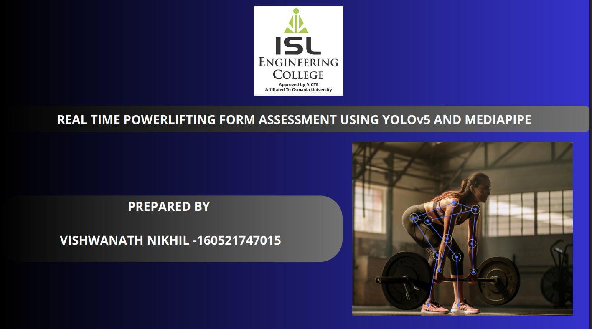

# Exercise Form Correction with Feedback Mechanism

---

## 🔹 Project Introduction
Improper exercise form, especially in **powerlifting exercises** like bench press, squat, and deadlift, often leads to injuries and reduced performance.  
This project provides a **machine learning–based solution** that classifies exercise postures and delivers **real-time corrective feedback** using an integrated voice mechanism.  

---

## 📊 Dataset Collection
The dataset was collected through **video recordings of exercises** performed with different variations of form.  
Each frame was **manually labeled** into categories representing correct or incorrect posture for:
- **Bench Press** → `b_arms_spread`, `b_excessive_arch`, `b_correct`  
- **Deadlift** → `d_arms_narrow`, `d_arms_spread`, `d_correct`, `d_spine_neutral`  
- **Squat** → `s_caved_in_knees`, `s_correct`, `s_feet_spread`, `s_spine_neutral`  

---

## ⚙️ Preprocessing
- Data was **cleaned and transformed** into structured form.  
- Exercise frames were **labeled** into specific posture classes.  
- Processed data was prepared for ML model training.  

---

## 🤖 Model Building
The project applies **Machine Learning classifiers**  for posture classification:
- Logistic Regression  
- Ridge Classifier  
- Random Forest  
- Gradient Boosting  

These models were trained and compared to identify the best-performing classifier for posture recognition.  

---

## 🗣️ Feedback Mechanism
A **voice feedback mechanism** was integrated, where audio prompts guide the user to correct form.  
Examples include:  
- “Keep your spine neutral”  
- “Avoid excessive arch”  
- “Bring your arms closer”  
- “Correct posture maintained”  

This allows users to receive **real-time guidance** while performing exercises.  

---

## 📑 Project Presentation
The complete project details are available in the presentation below:  

